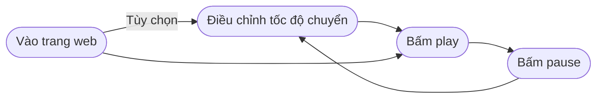

# HANGUL CHARACTER APP 
## 1. Mục tiêu dự án: 
Ứng dụng giúp người dùng học nhận diện khối chữ hangul với tốc độ nhanh hơn, não làm quen nhanh hơn, không còn đánh vần từng kí tự mà có thể đọc ngay. 

Mục tiêu cuối cùng: 
- Nhìn khối chữ -> đọc ngay. 
- Không cần tách nguyên âm, phụ âm. 
- Đọc nhanh được một từ gồm nhiều hơn 1 khối chữ. 
=> Làm nền cho bước học từ vựng. Não chỉ lo tiếng và nghĩa, không phải quá tải vấn đề đánh vần và đọc nữa. 

----------------

## 2. Đối tượng sử dụng: 
- Người bắt đầu vào học từ vựng nhưng vẫn còn đánh vần từng từ khi phát âm. 
- Người bắt đầu vào học từ vựng nhưng đọc còn chậm. 

### 3. Nguyên lí: 
Não người HA tạo ra quá tuyệt vời rồi. Chỉ cần luyện tập nhiều để cho nó thông tin và thời gian nghỉ ngơi để nó tái cấu trúc chính não để có thể nhìn và đọc được ngay là được. 

### 4. Các chức năng chính: 
v1 mình sẽ làm đơn giản thôi: 
- Tự động chuyển sang từ vựng mới random sau một khoảng thời gian. 
- Thời gian này người dùng có thể chọn trong các lựa chọn được đặt ra trước. 
    - Beginner - 5s
    - Practice - 3s
    - Normal - 2s (mặc định)
    - Fast - 1.5s 
    - Speed - 1s 
    - Flash - 0.5s 
- Kho dữ liệu thì mình sẽ đặt trước trong cơ sở dữ liệu. Người dùng không làm điều này. 
- Có chức năng tạm dừng/chạy, để việc chuyển từ vựng mới được dùng lại. 

### 5. Nguyên tắc thiết kế: 
- Mobile 
- Offline 

### 6. Luồng người dùng: 

### 7. Cơ sở dữ liệu: 
words
-----
id (PK)
content
level
updated_at
created_at 